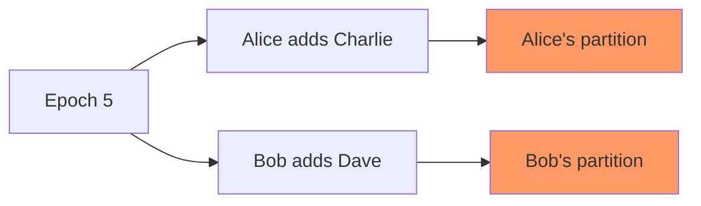

When different group members merge conflicting commits, the group state becomes forked. Members in different partitions have different keys and cannot decrypt each other's messages. OpenMLS provides helpers to resolve forks and restore group consistency.

<Warning>
Forks should not occur during normal operation. These tools are designed for recovery from exceptional situations like bugs or network partitions.
</Warning>

## Understanding forks

A fork occurs when:

1. Multiple group members create commits simultaneously
2. Different subsets of the group merge different commits
3. The group is now split into partitions with incompatible states



Members in different partitions cannot communicate until the fork is resolved.

## Resolution strategies

OpenMLS provides two fork resolution mechanisms:

<CardGroup cols={2}>
  <Card title="Re-add strategy" icon="user-plus">
    Remove and re-add members in the wrong partition. Requires knowing which members are forked.
  </Card>
  
  <Card title="Reboot strategy" icon="rotate">
    Create a new group and migrate all members. Works without knowing partition membership.
  </Card>
</CardGroup>

<Note>
The re-add strategy is more efficient for small forks. The reboot strategy is simpler when partition membership is unknown.
</Note>

## Re-add strategy

The re-add approach removes and re-adds members who merged the "wrong" commit. This requires:

- Knowledge of which members are in your partition
- New key packages for members being re-added

### Step 1: Enable fork resolution

Add the `fork-resolution-helpers` feature to your `Cargo.toml`:

```toml
openmls = { version = "0.8", features = ["fork-resolution-helpers"] }
```

### Step 2: Identify your partition

Determine which members are in your partition (see [Fork Detection](#fork-detection)):

```rust
// Alice knows she and Charlie are in one partition
// Bob merged a different commit and needs to be re-added
let own_partition = vec![alice_group.own_leaf_index()];
```

### Step 3: Collect new key packages

Obtain fresh key packages for members in other partitions:

```rust
// Bob generates a new key package
let bob_new_kpb = generate_key_package(
    ciphersuite,
    Extensions::empty(),
    bob_provider,
    bob_credentials,
);
```

### Step 4: Execute recovery

Use the `recover_fork_by_readding()` method:

```rust
use openmls::group::fork_resolution::*;

// Start the recovery process
let builder = alice_group
    .recover_fork_by_readding(&own_partition)
    .unwrap();

// Get list of members to re-add
let complement_partition = builder.complement_partition();

// Map members to new key packages
let key_packages = complement_partition
    .iter()
    .map(|member| match member.credential.serialized_content() {
        b"Bob" => bob_new_kpb.key_package().clone(),
        b"Charlie" => charlie_new_kpb.key_package().clone(),
        _ => panic!("Unknown member"),
    })
    .collect();

// Complete the recovery
let message_bundle = builder
    .provide_key_packages(key_packages)
    .load_psks(provider.storage())
    .unwrap()
    .build(provider.rand(), provider.crypto(), &signer, |_| true)
    .unwrap()
    .stage_commit(provider)
    .unwrap();

let (_commit, welcome, _group_info) = message_bundle.into_messages();
alice_group.merge_pending_commit(provider).unwrap();
```

### Step 5: Re-join the group

Re-added members join using the Welcome message:

```rust
// Bob deletes his old forked group
bob_group.delete(provider.storage()).unwrap();

// Bob joins using the Welcome message
let welcome: MlsMessageIn = welcome.unwrap().into();
let welcome = welcome.into_welcome().unwrap();
let ratchet_tree = alice_group.export_ratchet_tree();

let new_bob_group = StagedWelcome::new_from_welcome(
    provider,
    alice_group.configuration(),
    welcome,
    Some(ratchet_tree.into()),
)
.unwrap()
.into_group(provider)
.unwrap();
```

## Reboot strategy

The reboot approach creates a new group and migrates all members. This doesn't require knowing which members are forked.

### Step 1: Initiate reboot

Create a reboot builder with a new group ID:

```rust
use openmls::group::fork_resolution::*;

let new_group_id = GroupId::from_slice(b"new-group-id");
let reboot_builder = alice_group.reboot(new_group_id);
```

### Step 2: Migrate extensions

Retrieve old group context extensions and update them for the new group:

```rust
// Get old extensions
let old_extensions = reboot_builder.old_group_context_extensions();

// Application updates extensions as needed
// For example, update group ID references
let new_extensions = Extensions::empty();
```

### Step 3: Collect new key packages

Get fresh key packages for all members:

```rust
// Get list of members (excluding self)
let old_members: Vec<_> = reboot_builder.old_members().collect();

// Collect new key packages for all members
let new_members = vec![
    bob_new_kpb.key_package().clone(),
    charlie_new_kpb.key_package().clone(),
];
```

### Step 4: Finalize reboot

Create the new group and add all members:

```rust
let (mut new_alice_group, message_bundle) = reboot_builder
    .finish(
        new_extensions,
        new_members,
        |builder| builder, // Optional commit builder refinement
        provider,
        &signer,
        credential_with_key,
    )
    .unwrap();

let (_commit, welcome, _group_info) = message_bundle.into_messages();
new_alice_group.merge_pending_commit(provider).unwrap();
```

### Step 5: Members join new group

All members join the new group using the Welcome message:

```rust
let welcome: MlsMessageIn = welcome.unwrap().into();
let welcome = welcome.into_welcome().unwrap();
let ratchet_tree = new_alice_group.export_ratchet_tree();

let new_bob_group = StagedWelcome::new_from_welcome(
    provider,
    alice_group.configuration(),
    welcome.clone(),
    Some(ratchet_tree.clone().into()),
)
.unwrap()
.into_group(provider)
.unwrap();
```

## Fork detection

Before resolving a fork, you must detect it occurred and identify partition membership.

### Detecting forks

Possible detection techniques:

<Steps>
  <Step title="Decryption failures">
    Messages that fail to decrypt may indicate a fork, though false positives are possible.
  </Step>
  
  <Step title="Commit hash exchange">
    Members send the hash of commits they merge (encrypted for the old epoch). Differing hashes indicate a fork.
  </Step>
  
  <Step title="Epoch mismatch">
    Messages from the same epoch but with incompatible state suggest a fork.
  </Step>
</Steps>

### Identifying partitions

For the re-add strategy, use commit hash exchange:

```rust
// After merging a commit, send its hash to the group
// (encrypted for the previous epoch)
let commit_hash = compute_commit_hash(&commit);
let hash_message = old_epoch_group.create_message(
    provider,
    &signer,
    &commit_hash,
)
.unwrap();

// Members receiving different commit hashes know they're in different partitions
```

Members who merged the same commit are in the same partition.

## Choosing a strategy

<AccordionGroup>
  <Accordion title="Use re-add when..." icon="user-plus">
    - You know which members are in each partition
    - Only a small number of members need re-adding
    - You want to minimize overhead
  </Accordion>
  
  <Accordion title="Use reboot when..." icon="rotate">
    - Partition membership is unknown
    - Most or all members are affected
    - You need to migrate group context extensions
  </Accordion>
</AccordionGroup>

## Best practices

- **Prevention first**: Use proper commit serialization and delivery ordering to prevent forks
- **Detection early**: Implement commit hash exchange for quick fork detection
- **Coordinate recovery**: Designate a recovery coordinator to avoid multiple recovery attempts
- **Clean up**: Delete old forked group instances after successful recovery

## Related

- [Commit Builder](/api/messages/commits) - Understanding commit operations
- [Processing Messages](/user-manual/processing-messages) - Message handling
- Source: `/workspace/source/openmls/src/group/fork_resolution/` for implementation details
